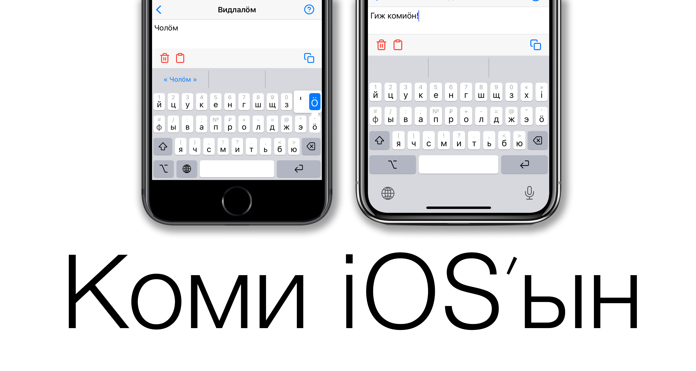

# Komi keyboard

The iOS keyboard layout for the Komi language. Fully functioning with Komi cyrillic letters and Russian suggestion dictionary. 

## App Store

If you have any troubles or questions please contact me on [VK](https://vk.com/AlexTheSun), [Telegram](https://t.me/majbyrcom) or [Facebook](https://www.facebook.com/AleksiAurinko).

## Source
The code was adopted from the [iBepo](https://github.com/sgigou/ibepo) project that was made by [Steve Gigou](https://steve.gigou.fr)
